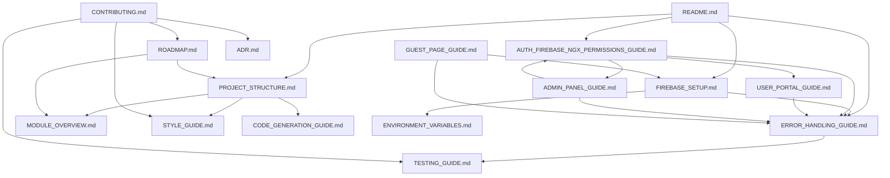

# 文件交叉引用索引

## 目錄
- [簡介](#簡介)
- [核心文件關係圖](#核心文件關係圖)
- [文件依賴關係](#文件依賴關係)
- [服務與組件引用關係](#服務與組件引用關係)
- [錯誤處理統一引用](#錯誤處理統一引用)
- [快速導航](#快速導航)

## 簡介
此文件提供專案所有技術文件的交叉引用索引，幫助開發者快速理解文件間的關係和依賴，確保開發時遵循統一的規範和最佳實踐。

## 核心文件關係圖



## 文件依賴關係

### 第一層：基礎文件
- **README.md** - 專案入口文件
  - 依賴：無
  - 被引用：所有其他文件

### 第二層：核心架構文件
- **PROJECT_STRUCTURE.md** - 專案結構定義
  - 依賴：無
  - 被引用：MODULE_OVERVIEW.md, STYLE_GUIDE.md, CODE_GENERATION_GUIDE.md, ROADMAP.md

- **FIREBASE_SETUP.md** - Firebase 配置指南
  - 依賴：ERROR_HANDLING_GUIDE.md, ENVIRONMENT_VARIABLES.md
  - 被引用：AUTH_FIREBASE_NGX_PERMISSIONS_GUIDE.md, USER_PORTAL_GUIDE.md, GUEST_PAGE_GUIDE.md

### 第三層：功能模組文件
- **AUTH_FIREBASE_NGX_PERMISSIONS_GUIDE.md** - 認證與權限
  - 依賴：ERROR_HANDLING_GUIDE.md, FIREBASE_SETUP.md
  - 被引用：USER_PORTAL_GUIDE.md, ADMIN_PANEL_GUIDE.md

- **ERROR_HANDLING_GUIDE.md** - 錯誤處理規範
  - 依賴：無
  - 被引用：所有功能模組文件

### 第四層：具體實現文件
- **USER_PORTAL_GUIDE.md** - 用戶入口
  - 依賴：ERROR_HANDLING_GUIDE.md, FIREBASE_SETUP.md, AUTH_FIREBASE_NGX_PERMISSIONS_GUIDE.md
  - 被引用：無

- **ADMIN_PANEL_GUIDE.md** - 管理面板
  - 依賴：ERROR_HANDLING_GUIDE.md, AUTH_FIREBASE_NGX_PERMISSIONS_GUIDE.md
  - 被引用：無

- **GUEST_PAGE_GUIDE.md** - 訪客頁面
  - 依賴：FIREBASE_SETUP.md, ERROR_HANDLING_GUIDE.md
  - 被引用：無

### 第五層：開發工具文件
- **STYLE_GUIDE.md** - 程式碼風格
  - 依賴：PROJECT_STRUCTURE.md, ERROR_HANDLING_GUIDE.md
  - 被引用：CONTRIBUTING.md, CODE_GENERATION_GUIDE.md

- **TESTING_GUIDE.md** - 測試指南
  - 依賴：ERROR_HANDLING_GUIDE.md
  - 被引用：CONTRIBUTING.md

- **CODE_GENERATION_GUIDE.md** - 程式碼生成
  - 依賴：PROJECT_STRUCTURE.md, STYLE_GUIDE.md
  - 被引用：無

### 第六層：專案管理文件
- **CONTRIBUTING.md** - 貢獻指南
  - 依賴：STYLE_GUIDE.md, TESTING_GUIDE.md, ROADMAP.md, ADR.md
  - 被引用：無

- **ROADMAP.md** - 開發路線圖
  - 依賴：PROJECT_STRUCTURE.md, MODULE_OVERVIEW.md
  - 被引用：CONTRIBUTING.md

- **ADR.md** - 架構決策記錄
  - 依賴：PROJECT_STRUCTURE.md, FIREBASE_SETUP.md
  - 被引用：CONTRIBUTING.md

## 服務與組件引用關係

### 核心服務
- **FirebaseService** 
  - 定義位置：`src/app/core/services/firebase.service.ts`
  - 引用位置：USER_PORTAL_GUIDE.md, ADMIN_PANEL_GUIDE.md, GUEST_PAGE_GUIDE.md
  - 依賴：ERROR_HANDLING_GUIDE.md

- **NotificationService**
  - 定義位置：`src/app/core/services/notification.service.ts`
  - 引用位置：ERROR_HANDLING_GUIDE.md, USER_PORTAL_GUIDE.md, STYLE_GUIDE.md
  - 依賴：無

- **PermissionsService**
  - 定義位置：`src/app/core/services/permissions.service.ts`
  - 引用位置：AUTH_FIREBASE_NGX_PERMISSIONS_GUIDE.md, ADMIN_PANEL_GUIDE.md
  - 依賴：ERROR_HANDLING_GUIDE.md

### 核心組件
- **LoginComponent**
  - 定義位置：`src/app/users/containers/login/login.component.ts`
  - 引用位置：USER_PORTAL_GUIDE.md
  - 依賴：FirebaseService, NotificationService

- **AdminPanelComponent**
  - 定義位置：`src/app/admin/components/admin-panel.component.ts`
  - 引用位置：ADMIN_PANEL_GUIDE.md
  - 依賴：FirebaseService, PermissionsService

## 錯誤處理統一引用

### 統一錯誤處理規範
所有文件中的錯誤處理都應遵循以下統一規範：

1. **錯誤處理服務引用**
   ```typescript
   // 統一引用 ERROR_HANDLING_GUIDE.md 中定義的 NotificationService
   import { NotificationService } from 'src/app/core/services/notification.service';
   ```

2. **錯誤處理模式**
   ```typescript
   // 標準錯誤處理模式
   try {
     // 業務邏輯
   } catch (error) {
     console.error('操作失敗:', error);
     this.notificationService.showError('操作失敗，請重試');
   }
   ```

3. **Firebase 錯誤處理**
   ```typescript
   // Firebase 操作錯誤處理
   this.firebaseService.someOperation().subscribe({
     next: (result) => {
       this.notificationService.showSuccess('操作成功');
     },
     error: (error) => {
       console.error('Firebase 操作失敗:', error);
       this.notificationService.showError('操作失敗，請檢查網路連線');
     }
   });
   ```

### 需要更新的文件
以下文件需要統一錯誤處理引用：

1. **USER_PORTAL_GUIDE.md** ✅ 已正確引用
2. **ADMIN_PANEL_GUIDE.md** ✅ 已正確引用
3. **STYLE_GUIDE.md** ✅ 已正確引用
4. **AUTH_FIREBASE_NGX_PERMISSIONS_GUIDE.md** ✅ 已正確引用

## 快速導航

### 按功能分類
- **專案架構**：PROJECT_STRUCTURE.md, MODULE_OVERVIEW.md, ADR.md
- **Firebase 配置**：FIREBASE_SETUP.md, ENVIRONMENT_VARIABLES.md
- **認證權限**：AUTH_FIREBASE_NGX_PERMISSIONS_GUIDE.md, USER_PORTAL_GUIDE.md
- **管理功能**：ADMIN_PANEL_GUIDE.md, GUEST_PAGE_GUIDE.md
- **錯誤處理**：ERROR_HANDLING_GUIDE.md
- **開發工具**：STYLE_GUIDE.md, TESTING_GUIDE.md, CODE_GENERATION_GUIDE.md
- **專案管理**：CONTRIBUTING.md, ROADMAP.md

### 按開發階段分類
- **開始開發**：README.md → PROJECT_STRUCTURE.md → FIREBASE_SETUP.md
- **功能開發**：AUTH_FIREBASE_NGX_PERMISSIONS_GUIDE.md → USER_PORTAL_GUIDE.md → ADMIN_PANEL_GUIDE.md
- **程式碼品質**：STYLE_GUIDE.md → TESTING_GUIDE.md → ERROR_HANDLING_GUIDE.md
- **專案維護**：CONTRIBUTING.md → ROADMAP.md → ADR.md

### 按技術棧分類
- **Angular 19**：STYLE_GUIDE.md, CODE_GENERATION_GUIDE.md, TESTING_GUIDE.md
- **Firebase**：FIREBASE_SETUP.md, AUTH_FIREBASE_NGX_PERMISSIONS_GUIDE.md
- **TypeScript**：STYLE_GUIDE.md, PROJECT_STRUCTURE.md
- **權限管理**：AUTH_FIREBASE_NGX_PERMISSIONS_GUIDE.md, ADMIN_PANEL_GUIDE.md

---

## 維護說明
此索引文件應在以下情況更新：
1. 新增技術文件時
2. 修改文件依賴關係時
3. 新增核心服務或組件時
4. 更新錯誤處理規範時

最後更新：2024-12-19 